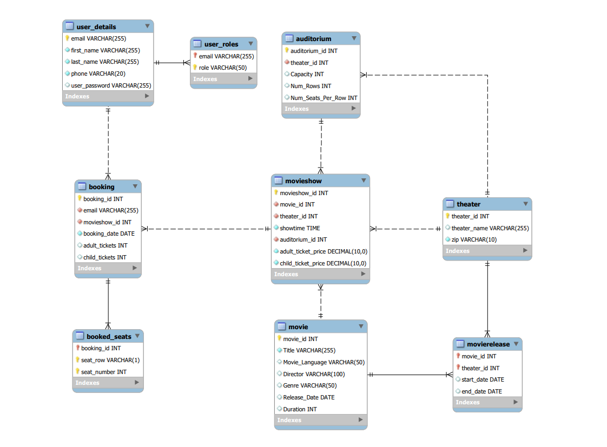

# MovieTime application
This is a simple movie ticket booking application that allows user to browse
list of movies and book a show for a particular movie

## Entity-Relationship diagram

## Technology stack
This is a Spring Boot based web application
It makes use of following dependencies

### Spring security
This application uses Spring security to implement Authentication.
It uses Spring security configuration to implement application login and logout
functionality

### Spring Data JPA
This application uses Spring Data JPA library to implement DAO layer of this application
DAO layer of this application is built using JpaRepository interface
Application uses Hibernate ORM framework to map domain entities
to corresponding database tables

### Spring REST API
This application exposes application functionality using REST APIs
built using RestControllers

### Spring MVC
This application uses Spring MVC Controllers to implement
endpoints that help serve initial single HTML page of this application
that includes Movietime UI application built using React

### JUnit and Mockito
This application uses JUnit and Mockito framework to implement unit
test cases.

## Directory structure
### src/main/java/api
This directory contains MVC Controller classes as well as REST controller classes
### src/main/java/config
This directory contains Spring Boot application config classes such as
Spring security configuration.
### src/main/java/domain
This directory contains application's domain components
#### src/main/java/domain/entities
This directory contains all entity classes
#### src/main/java/domain/repositories
This directory includes all JpaRepository interfaces that are
implemented by Spring Data JPA library at runtime
#### src/main/java/domain/services
This directory includes all application service classes that implement
business
#### src/main/java/domain/exceptions
This directory contains all domain exception classes
#### src/main/java/domain/vo
This directory contains all value object classes that are used to
send/receive data object from the frontend
#### src/main/resources/static/js
This directory contains bundled React application javascript files
#### src/main/resources/static/css
This directory contains bundled React application css file(s)

## Building application
Run command "mvn clean install"

## Running application
Run command "mvn spring-boot:run"